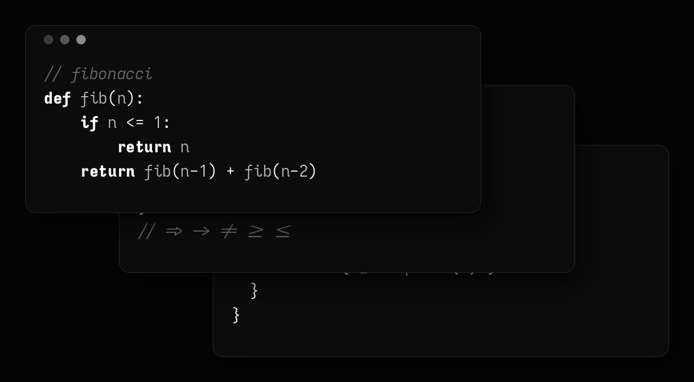
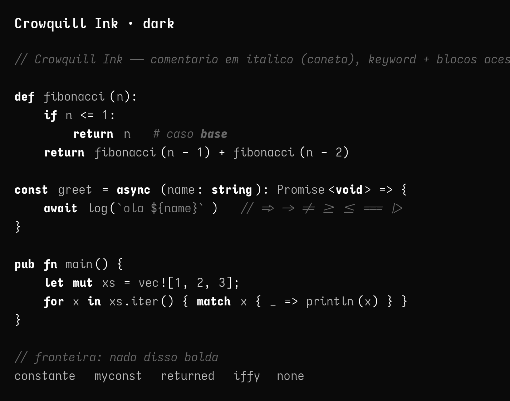
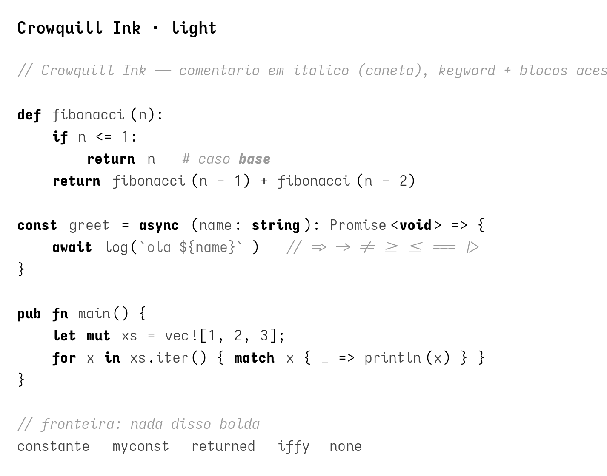

# Crowquill Ink

A monochrome black & white theme for editors and terminal — companion to the [Crowquill Mono](https://github.com/andersonflima/crowquill-mono) font.

Crowquill Ink is strictly grayscale: no hue, only ink. Backgrounds are near-black, text is muted gray, and the brightest tone (pure white `#FFFFFF`) is reserved for keywords and shell commands so structure reads at a glance.



## Preview

Dark — fundo preto, fonte branca:



Light — fundo branco, fonte preta:



## Palette

| Role                | Hex       |
| ------------------- | --------- |
| Background          | `#0A0A0A` |
| Foreground          | `#B8B8B8` |
| Keyword / command   | `#FFFFFF` |
| Cursor              | `#FFFFFF` |
| Selection           | `#2A2A2A` |
| Comment             | `#6A6A6A` |
| String              | `#8C8C8C` |
| Number              | `#D2D2D2` |
| Dim                 | `#4A4A4A` |

## Neovim

The repository root is a [lazy.nvim](https://github.com/folke/lazy.nvim) colorscheme plugin (colorschemes live in `colors/`).

```lua
{
  "andersonflima/crowquill-theme",
  lazy = false,
  priority = 1000,
  config = function()
    vim.cmd.colorscheme("crowquill")
  end,
}
```

A light variant is also included:

```lua
vim.cmd.colorscheme("crowquill-light")
```

## VS Code

Copy the extension folder into your VS Code extensions directory:

```sh
cp -r vscode ~/.vscode/extensions/crowquill-ink
```

Or open the `vscode/` folder in VS Code and install it locally. Then open the
Command Palette → "Color Theme" and select **Crowquill Ink Dark** or
**Crowquill Ink Light**.

## Ghostty

Include the color file from your Ghostty config:

```
config-file = /path/to/crowquill-theme/terminal/ghostty/crowquill-ink.conf
```

## tmux

Source the theme from your `tmux.conf`:

```
source /path/to/crowquill-theme/terminal/tmux/crowquill-ink.conf
```

## fish

Source the colors from your `config.fish`:

```fish
source /path/to/crowquill-theme/terminal/fish/crowquill-ink.fish
```

## starship

Merge `terminal/starship/crowquill-ink.toml` into your `~/.config/starship.toml`.
It defines a `[palettes.crowquill_ink]` table and sets `palette = "crowquill_ink"`.

## License

[MIT](./LICENSE) © 2026 Anderson Faustino Lima
